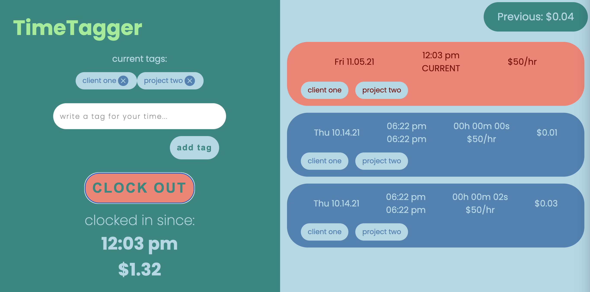

# TimeTagger

## The Concept

_TimeTagger_ is a fullstack web app that allows users to clock in & out with user-defined tags attached to each block of time, allowing them to track total time spent working for a particular client, on a particular project, etc.

Check out a demo of the app [here](https://boiling-sea-53421.herokuapp.com/).

Screenshot:

---

## Background

_TimeTagger_ was built entirely by Sam Pool, originally for the 2-day MVP assignment for the [Hack Reactor](https://www.hackreactor.com/) _Advanced Software Engineering Immersive_ program.

The first line of code for _TimeTagger_ was written at 4:45am on 10/12/21 and within 55 hours the functioning full-stack app had been successfully deployed to Heroku. Since deployment, small updates have been made incrementally.

---

## Future Goals

The one main feature currently missing from this app which admittedly limits its usefulness significantly is a **user login** feature. Because of the lack of this feature, users can still clock in/out with tags on their time block, but all users are manipulating the same time log.

A user login feature is planned for this app and **the goal is to have the feature implemented before February of 2022**.

---

## Primary Technologies

This app was built using the following primary technologies:

### Frontend

- **ReactJS**
  - Frontend javascript framework used to build the user interface.
- **Babel**
  - Transpilation package used to convert ReactJS-specific syntax into browser-consumable JavaScript.
- **Webpack**
  - Bundling package used to bundle javascript modules and component-focused stylesheets into `.js` and `.css` bundles for browser comsumption.

### Backend

- **ExpressJS**
  - Backend javascript framework used to develop the API server.
- **PostgreSQL**
  - SQL RDMS used for data persistence - accessed via the **pg** driver package.

### Testing

- **Jest**
  - Testing framework, primarily used for testing data model methods and API calls.
- **SuperTest**
  - Testing library used to make API server calls within Jest.

---

## Installation

Steps for getting started as a developer on this repo:

1. Clone this repo onto your local machine:
   - `git clone https://github.com/mrsampool/time-tagger.git`
2. Navigate into the repo's root directory:
   - `cd time-tagger`
3. Install the project's depencies:
   - `npm install`
4. For local development, set up a local [PostgreSQL](https://www.postgresql.org/docs/) database.
   - Once your local database is available, create a `.env` file in the root directory containing your local database info. For reference, see the provided `.env.example`.
   - **NOTE:** The app will automatically use the local database specified in the `.env` file anytime the app is run **_without_** a `NODE_ENV` environment variable set to `production`. This is handled by the `dotenv` package - for more info, see the [docs](https://www.npmjs.com/package/dotenv)
5. Start developing!

---

## Provided Scripts

- `npm run dev-build`
  - bundles the contents of the `client/src/` directory (also transpiling JavaScript as needed for browser consumption) into bundled `.js` and `.css` files which are linked into the `index.html` page, then **watches for changes and re-bundles on each file change.**
- `npm run dev-server`
  - starts a development server which serves the client app (and responds to API requests) from localhost - by default on localhost:3000 - then **watches for changes and restarts the server with updated content on each file change**.
- `npm run build`
  - builds the app for production - **does not watch for files changes**.
- `npm run start`
  - runs the app's server (serves the client app's static files as well as the API requests) - **does not watch for files changes**.
- `npm run test`
  - runs the app's full test suite via **Jest**, automatically running all files with a `.test.jsx` or `test.js` file extension.

---

## Project Structure

- `client/`

  - files related to the ReactJS client application
  - `build/`
    - static bundled and transpiled files (as well as the `index.html`) to be served as the client application
  - `src/`
    - source files for the client application
    - `components/`
      - ReactJS component files (`.jsx`) and their associated style sheets (`.css`), organized by component.
    - `globalStyles/`
      - `.css` stylesheets containing rules to be applied across the entire app.
    - `App.jsx`
      - The parent client application component which renders all child components.
    - `index.js`
      - the root JavaScript file of the webpack bundle - imports the `App.jsx` file and injects it into the `/client/dist/index.html` page.

- `server/`
  - files for the ExpressJS server responsible for serving the client app as well as responding to API requests from the front end.
  - `app.js`
    - The root server file - serves static content and calls the API router to handle any requests to `/api`.
    - **_NOTE:_** This file does not listen on any port - listening takes place in `server/index.js`. This seperation allows the app to be tested the [supertest](https://www.npmjs.com/package/supertest) module without port conflicts.
    - `app.test.js`
      - This file is set up for testing the API via [supertest](https://www.npmjs.com/package/supertest). While these tests are very crude currently, the existing tests serve as an example of how to test different API endpoints.
  - `index.js`
    - This file simply runs the `app.js` file described above on the port specified by the `PORT` environment variable (outside of production, this variable is defined in the `.env` file).
    - **_This is the file which launches this entire app_**.
  - `apiRouter.js`
    - Exports an `express.Router()` instance as `apiRouter` which connects the various API routes to their appropriate methods in `controller.js`.
  - `controller.js`
    - Exports methods which perform the functionality required to handle the various server requests - i.e. running appropriate methods from the data models (**_see below_**) and responding to the requests with the desired data.
- `db/`

  - files related to the PostgreSQL database
  - `models/`
    - Data models containing methods for interacting with the database.
  - `index.js`
    - connects to a PostgreSQL database and exports the connection as `pool`.
    - **NOTE:** If the app is running with a `NODE_ENV` environment variable set to `production`, the app will attempt to connect to a database via a connection string passed in as a `DATABASE_URL` environment variable, **_otherwise_** it will refer to the database config specified in `dbConfig.js` (see below).
  - `config.js`
    - exports local database connection config as `dbConfig`. The values for this config are pulled from the `.env` file via the [dotenv](https://www.npmjs.com/package/dotenv) package.
  - `schema.sql`
    - The schema for the entire database. Starts by **_DROPPING the database_** and rebuilding an empty one.
  - `reset.sh`
    - Shell script which runs the `schema.sql` file described above. **WARNING:** As mentioned above, running this script will empty out your entire database. Do not use without backing up any valuable data.

- etc...
  - config files for webpack, babel, jest, etc

---

## Questions / Comments?

Feel free to reach to developer Sam Pool about this project. I would love to hear from you!

- GitHub: [github.com/mrsampool](https://github.com/mrsampool)
- LinkedIn: [linkedin.com/in/sampool](https://www.linkedin.com/in/sampool/)
- Portfolio: [sampool.dev](https://sampool.dev/)
- Email: sambpool@gmail.com
